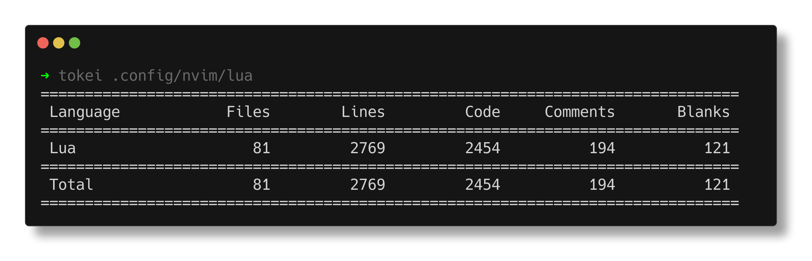

# Salutations!  👋

 ⚡ Experience with:
  - C, C++, Python, JS/TS, Bash, Rust...
  - React/React-Native
  - Next.js
  - Supabase/Firebase
  - Linux (Arch btw)
  - Qt (C++)
  - Much more

❤️ Arch Linux\
❤️ Neovim\
❤️ FOSS\
❤️ dwm

My Neovim Insanity

# In possession of a 2700-line hand-written neovim config...

